# 🚀 Enterprise TIBCO BWCE Multi-Cluster GitOps Platform on OpenShift 4.20+ (Pure GitOps)

> [!WARNING]
> **AI Generation & Template Disclaimer**
> This repository has been generated by **Gemini 3.7 Flash** and has not been tested nor validated in a real production environment. Its purpose is strictly for the generation of reference architectures, templates, design patterns, and Infrastructure as Code (IaC) blueprints.

<div align="center">

<!-- Row 1: Core Platform & Infrastructure -->
[](https://docs.redhat.com/en/documentation/openshift_container_platform/4.17/)
[](https://kubernetes.io/)
[](https://docs.tibco.com/)
[](https://www.jenkins.io/)
[](https://argo-cd.readthedocs.io/en/stable/)

<br/>

<!-- Row 2: Developer Portals & Governance / ITSM -->
[](https://backstage.io/)
[](https://www.servicenow.com/products/change-management.html)
[](https://www.atlassian.com/software/jira/service-management)
[](https://opengitops.net/)
[](https://csrc.nist.gov/publications/detail/sp/800-207/final)

<br/>

<!-- Row 3: Architecture & Progressive Delivery -->
[](https://www.jenkins.io/)
[](https://argo-cd.readthedocs.io/en/stable/operator-manual/applicationset/)
[](https://argoproj.github.io/argo-rollouts/)
[](https://en.wikipedia.org/wiki/Sarbanes%E2%80%93Oxley_Act)

<br/>

<!-- Row 4: Observability & APM -->
[](https://www.datadoghq.com/)
[](https://docs.datadoghq.com/developers/dogstatsd/)
[](https://prometheus.io/)
[](https://www.w3.org/TR/trace-context/)

<br/>

<!-- Row 5: Supply Chain Security & Hardening -->
[](https://docs.sigstore.dev/cosign/overview/)
[](https://github.com/anchore/syft)
[](https://trivy.dev/)
[](https://docs.redhat.com/en/documentation/openshift_container_platform/4.17/html/authentication_and_authorization/managing-pod-security-policies)
[](https://external-secrets.io/)

<br/>

<!-- Row 6: Automation & Tech Stack -->
[](https://www.jenkins.io/projects/jcasc/)
[](https://jenkinsci.github.io/job-dsl-plugin/)
[](https://12factor.net/)
[](https://github.com/containers/skopeo)

<br/>

<!-- Row 7: Project Health & Status -->
[](https://github.com/nubenetes/jenkins-without-git-parameter-bwce/actions)
[](LICENSE)
[](https://github.com/nubenetes/jenkins-without-git-parameter-bwce/pulls)
[](https://github.com/nubenetes/jenkins-without-git-parameter-bwce)

</div>

> [!IMPORTANT]
> ### 🔗 Architecture Paradigm & Linked Repositories
> This platform implements the **Pure GitOps (Pull-based) Architecture for TIBCO BWCE microservices**, serving as the modern cloud-native alternative to the push-based [`nubenetes/jenkins-git-parameter-bwce`](https://github.com/nubenetes/jenkins-git-parameter-bwce) pattern:
> * 🚀 **Pure GitOps Platform Orchestrator (This Repository)**: [**`nubenetes/jenkins-without-git-parameter-bwce`**](https://github.com/nubenetes/jenkins-without-git-parameter-bwce) — Infrastructure-as-Code, Lean Jenkins JCasC CI, ArgoCD 3.5 ApplicationSets, Native TargetRevision Selection, and Datadog APM Observability.
> * 🌐 **Reference Push-Based Repository**: [**`nubenetes/jenkins-git-parameter-bwce`**](https://github.com/nubenetes/jenkins-git-parameter-bwce) — Legacy/Push model with Jenkins UI `gitParameter` dropdowns and multi-remote SCM Job DSL.
> * 📦 **Embedded Workload Microservices**: Located directly within [`sample-apps/tibco-bwce-order-service`](sample-apps/tibco-bwce-order-service) and [`sample-apps/tibco-bwce-customer-api`](sample-apps/tibco-bwce-customer-api) — TIBCO BusinessWorks™ Container Edition cloud-native microservices with 12-Factor `.substvar` profile externalization and Datadog APM integration.

---

## 📑 Table of Contents

- [Executive Summary & Architectural Paradigm Shift](#executive-summary--architectural-paradigm-shift)
- [In-Depth Architectural Comparison: Push vs. Pull Model for TIBCO BWCE](#in-depth-architectural-comparison-push-vs-pull-model-for-tibco-bwce)
  - [0. The Architectural Evolution: From Two-Pipeline CI/CD Hand-off to Pure GitOps for BWCE](#0-the-architectural-evolution-from-two-pipeline-cicd-hand-off-to-pure-gitops-for-bwce)
  - [1. Comprehensive Comparison Matrix: Jenkins Git Parameter vs. Pure GitOps for BWCE](#1-comprehensive-comparison-matrix-jenkins-git-parameter-vs-pure-gitops-for-bwce)
  - [2. The Root Cause of Jenkins SCM Friction in BWCE Builds](#2-the-root-cause-of-jenkins-scm-friction-in-bwce-builds)
  - [3. How Git & ArgoCD Solve BWCE Parameterization Natively](#3-how-git--argocd-solve-bwce-parameterization-natively)
  - [4. Why There is No 'jenkins-without-git-parameter-bwce-global-vars' Repository](#4-why-there-is-no-jenkins-without-git-parameter-bwce-global-vars-repository)
  - [5. Decoupled Architecture: Docker Images vs. Environment Variables & Placeholders](#5-decoupled-architecture-docker-images-vs-environment-variables--placeholders)
  - [6. Enterprise Developer Portals & Governance: Backstage IDP & ServiceNow / Jira ITSM Integration](#6-enterprise-developer-portals--governance-backstage-idp--servicenow--jira-itsm-integration)
- [TIBCO BWCE Cloud-Native Best Practices](#tibco-bwce-cloud-native-best-practices)
  - [1. 12-Factor Profile Externalization via `.substvar`](#1-12-factor-profile-externalization-via-substvar)
  - [2. Engine Sizing & JVM Performance Tuning](#2-engine-sizing--jvm-performance-tuning)
  - [3. OpenShift Hardening & Health Probing](#3-openshift-hardening--health-probing)
- [Datadog Full-Stack Observability Architecture](#datadog-full-stack-observability-architecture)
  - [1. Jenkins CI/CD Visibility Plugin](#1-jenkins-cicd-visibility-plugin)
  - [2. TIBCO BWCE Java APM Tracer & DogStatsD](#2-tibco-bwce-java-apm-tracer--dogstatsd)
  - [3. Progressive Delivery with Argo Rollouts & Datadog Metrics SLA](#3-progressive-delivery-with-argo-rollouts--datadog-metrics-sla)
- [Comprehensive Mermaid Architecture Diagrams & Workflows](#comprehensive-mermaid-architecture-diagrams--workflows)
  - [1. Parameter Flow Comparison (Jenkins Proxy vs. Pure GitOps)](#1-parameter-flow-comparison-jenkins-proxy-vs-pure-gitops)
  - [2. Legacy Global-Vars vs. Pure GitOps Repository Topology](#2-legacy-global-vars-vs-pure-gitops-repository-topology)
  - [3. End-to-End Multi-Cluster Platform Topology](#3-end-to-end-multi-cluster-platform-topology)
  - [4. Jenkins SCM Pre-Execution Lifecycle Blindspot](#4-jenkins-scm-pre-execution-lifecycle-blindspot)
  - [5. Side-by-Side Flow Comparison: Push vs. Pull](#5-side-by-side-flow-comparison-push-vs-pull)
  - [6. Dynamic Ephemeral Pull Request (PR) Preview Environments for BWCE](#6-dynamic-ephemeral-pull-request-pr-preview-environments-for-bwce)
  - [7. Automated BWCE CI -> GitOps Promotion Sequence](#7-automated-bwce-ci---gitops-promotion-sequence)
  - [8. ArgoCD Multi-Cluster Matrix Reconciliation Engine for BWCE](#8-argocd-multi-cluster-matrix-reconciliation-engine-for-bwce)
  - [9. Zero-Trust Security & RBAC Boundary Architecture](#9-zero-trust-security--rbac-boundary-architecture)
  - [10. Progressive Delivery with Argo Rollouts & Datadog SLA](#10-progressive-delivery-with-argo-rollouts--datadog-sla)
  - [11. Full-Stack Observability & Trace Context Propagation with Datadog](#11-full-stack-observability--trace-context-propagation-with-datadog)
- [Which Pattern is Easier, Recommended, and Why?](#which-pattern-is-easier-recommended-and-why)
- [Repository Structure](#repository-structure)
- [Quick Start: 1-Click Automated Deployment](#quick-start-1-click-automated-deployment)
- [Decommissioning & Reinstallation](#decommissioning--reinstallation)
- [References & Standards](#references--standards)

---

## Executive Summary & Architectural Paradigm Shift

For enterprise integration platforms hosting **TIBCO BusinessWorks™ Container Edition (BWCE 2.9.2 / 2.10.0)** on **Red Hat OpenShift 4.20+**, organizations face a crucial architectural decision:

1. **The Legacy Push Model (`jenkins-git-parameter-bwce`)**:
   Jenkins is used as a manual deployment gate. Developers log into the Jenkins Web UI, select the BWCE application branch and environment configuration tag via `git-parameter` dropdowns, and Jenkins compiles the EAR, builds the container image, commits to the configuration repo, and triggers ArgoCD sync.
2. **The Declarative Pull Model (`jenkins-without-git-parameter-bwce` - Pure GitOps)**:
   Jenkins is decoupled and strictly scoped to **Continuous Integration (CI)** (compiling the BWCE project with `bw6-maven-plugin`, packaging the `.ear`, building the container image on top of `tibco/bwce:2.9.2`, scanning with Trivy, generating Syft SBOM, and signing with Cosign SLSA 3). Jenkins has **zero deployment parameters and zero cluster credentials**.
   
   **All parameter selections (branches, tags, commits, `.substvar` profiles)** are executed natively via **Git (the Single Source of Truth)** and **ArgoCD 3.5**:
   - Feature branch testing via Git Pull Requests (ArgoCD ApplicationSets automatically create and destroy ephemeral preview environments).
   - Release selection via Git Semantic Versioning tags (`v1.2.0`, `release-2026.09`).
   - Ad-hoc overrides via ArgoCD UI/CLI native `targetRevision` tracking.

---

## In-Depth Architectural Comparison: Push vs. Pull Model for TIBCO BWCE

### 0. The Architectural Evolution: From Two-Pipeline CI/CD Hand-off to Pure GitOps for BWCE

> [!IMPORTANT]
> **Context & Heritage: The Patterns in `jenkins-git-parameter-bwce` vs. Pure GitOps**
>
> In the baseline repository [`jenkins-git-parameter-bwce`](https://github.com/nubenetes/jenkins-git-parameter-bwce), we evaluated two core Jenkins push patterns for enterprise TIBCO BWCE environments:
> 1. **Pattern 1: Dual Git Parameter Dropdowns in a Single Pipeline (Multi-Remote SCM)**:  
>    Configured both the BWCE application repo and `jenkins-git-parameter-bwce-global-vars` inside a single `Job DSL` definition using custom refspecs (`origin-app` and `origin-vars`). While functional, it suffered from SCM namespace collisions, Jenkins master UI render latency, and workspace checkout quirks.
> 2. **Pattern 2: Decoupled Two-Pipeline Architecture (CI ➔ CD Hand-off) [RECOMMENDED in `jenkins-git-parameter-bwce`]**:  
>    Separated EAR compilation from release promotion:
>    * **Pipeline 01 (`01-CI-Build-Pipelines/*-ci-build`)**: Bound to the BWCE application repo with an `APP_GIT_REVISION` dropdown. Built the `.ear` via `bw6-maven-plugin`, layered it onto `tibco/bwce:2.9.2`, and triggered downstream.
>    * **Pipeline 02 (`02-CD-Release-Orchestrators/multi-cluster-release-orchestrator`)**: Bound directly to `jenkins-git-parameter-bwce-global-vars` with its own `GLOBAL_VARS_REVISION` dropdown (`DEV`, `STAGING`, `PROD`). Orchestrated multi-cluster image promotion (via Skopeo), committed `.substvar` profile updates to GitOps manifests, and invoked `argoAppSync`.
>
> While **Pattern 2 was the best possible design within the Jenkins Push Paradigm** (honoring Single Responsibility Principle and "Build Once, Deploy Anywhere"), it still kept **Jenkins as the manual Parameter Proxy, release coordinator, and credential holder** in Pipeline 02.
>
> In **[`jenkins-without-git-parameter-bwce`](https://github.com/nubenetes/jenkins-without-git-parameter-bwce) (This Repository)**, we complete the cloud-native evolution:
> * **Pipeline 02 is completely eliminated from Jenkins**: ArgoCD 3.5 natively performs all continuous delivery, drift detection, and multi-cluster reconciliation directly from Git.
> * **Pipeline 01 becomes a parameterless, webhook-driven CI engine**: Developers never interact with Jenkins UI dropdowns; pushing code or opening PRs automatically compiles the EAR, scans (Trivy), generates SBOM (Syft), signs (Cosign SLSA 3), and commits the image tag to GitOps.
> * **Release selection is native to Git & ArgoCD**: Handled via Git PRs, Semantic Version tags (`v1.2.0`), or ArgoCD's native `targetRevision` UI/CLI with 12-Factor `.substvar` profiles managed declaratively in Kustomize overlays.

<details>
<summary>🔄 <b>Click to expand: Three-Way Architectural Evolution Diagram (Pattern 1 vs. Pattern 2 vs. Pure GitOps for BWCE)</b></summary>

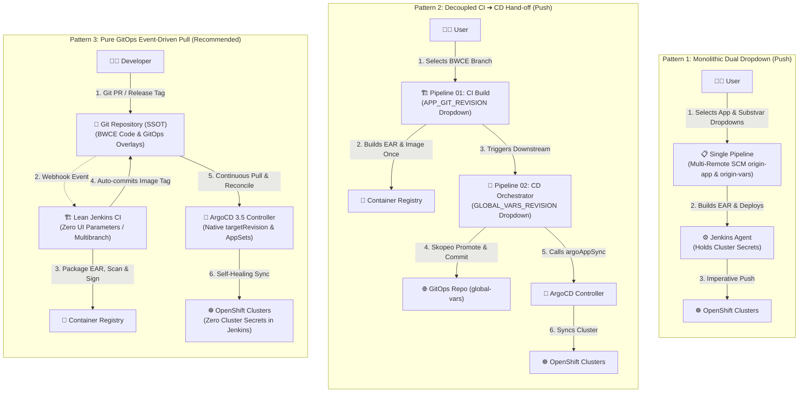

</details>

#### 📊 Three-Way Architecture Comparison Matrix for TIBCO BWCE

| Architectural Feature | Pattern 1 (Dual Dropdown Push) | Pattern 2 (Decoupled CI ➔ CD Hand-off Push) | Pure GitOps (This Repository) |
| :--- | :--- | :--- | :--- |
| **Jenkins Jobs Count** | 1 Monolithic Pipeline per BWCE app. | 2 Pipelines (01-CI-Build + 02-CD-Orchestrator). | **1 Parameterless CI Pipeline** per app. |
| **Parameter Interface** | Jenkins UI (2 dropdowns in 1 job). | Jenkins UI (1 dropdown in CI, 1 dropdown in CD). | **Git (PRs/Tags) & ArgoCD `targetRevision`**. |
| **`.substvar` Profile Binding** | Managed via Jenkins UI dropdown. | Managed via Pipeline 02 `global-vars` dropdown. | **Declarative Kustomize Overlays** in Git. |
| **SCM Complexity** | High (Multi-remote refspec bindings). | Moderate (Isolated SCM bindings per pipeline). | **Zero SCM Hacks** (Standard webhooks/branches). |
| **Release Trigger** | Manual human click in Jenkins. | Manual click or downstream trigger to Pipeline 02. | **100% Event-Driven** via Git webhooks / PRs. |
| **Jenkins Credentials** | High (Cluster tokens & Git write). | High (Cluster tokens, Skopeo, ArgoCD API keys). | **Zero Cluster Credentials** (Least Privilege). |
| **Deployment Engine** | Jenkins Agent (Push). | Jenkins Agent ➔ invokes ArgoCD sync. | **ArgoCD 3.5 Pull Controller** (Continuous). |
| **Ephemeral PR Envs** | Complex Groovy scripts. | Complex Groovy scripts in Pipeline 02. | **Native ArgoCD ApplicationSet PR Generator**. |
| **Configuration Drift** | Blindspot (No self-healing). | Blindspot (ArgoCD only syncs when Jenkins runs). | **Continuous Self-Healing** (24/7 reconciliation). |

---

### 1. Comprehensive Comparison Matrix: Jenkins Git Parameter vs. Pure GitOps for BWCE

| Architectural Dimension | `jenkins-git-parameter-bwce` (Push Model) | `jenkins-without-git-parameter-bwce` (Pure GitOps) | Advantage & Recommendation |
| :--- | :--- | :--- | :--- |
| **Control Model** | **Imperative Push**: Jenkins drives both EAR compilation and cluster deployment. | **Declarative Pull**: Jenkins handles CI only; ArgoCD continuously reconciles cluster state from Git. | 🏆 **GitOps**: Cloud-native standard (CNCF / OpenGitOps). |
| **Where Parameters are Selected** | **Jenkins Web UI**: User selects branch/tag/commit via `git-parameter` dropdowns. | **Git & ArgoCD**: Selected via Git branches, tags, PRs, or ArgoCD `targetRevision` UI/CLI. | 🏆 **GitOps**: Eliminates Jenkins UI lag and human form errors. |
| **BWCE Profile (`.substvar`) Management** | Split: Handled via Jenkins job parameters and external global-vars repo dropdowns. | **Declarative Overlays**: Managed cleanly via Kustomize overlays in the GitOps repository. | 🏆 **GitOps**: Immutable, versioned configuration. |
| **Single Source of Truth (SSOT)** | **Split**: Jenkins build history & job parameters determine deployed state. | **Pure Git**: Git repository commit history is the single, cryptographically auditable source of truth. | 🏆 **GitOps**: Immutable commit logs with GPG/Cosign attestation. |
| **Jenkins Master Performance** | **High Overhead**: Master dynamically queries remote Git refs before rendering build forms; SCM latency. | **Zero Overhead**: Jenkins uses lightweight webhooks and multibranch indexing; zero UI querying overhead. | 🏆 **GitOps**: Controller remains fast, stable, and highly responsive. |
| **Security & RBAC Boundary** | **High Exposure**: Jenkins Master & agents require cluster admin tokens and ArgoCD API keys. | **Zero-Trust**: Jenkins only has write access to internal container registry & Git repo. Only ArgoCD has cluster access. | 🏆 **GitOps**: Drastically reduced blast radius and attack surface. |
| **Configuration Drift Handling** | **Blindspot**: Out-of-band cluster changes (`oc edit`) cannot be detected until the next build. | **Continuous Self-Healing**: ArgoCD continuously monitors cluster state and automatically self-heals any drift. | 🏆 **GitOps**: Zero drift guarantee across all OpenShift clusters. |
| **Rollback Mechanism** | **Imperative Re-run**: Finding prior build in Jenkins and re-running with previous tags. | **Instant Git Revert**: Standard `git revert <commit>` or 1-click rollback in ArgoCD UI/CLI. | 🏆 **GitOps**: Deterministic, instant, and fully traceable. |
| **Ephemeral Preview Environments** | **Script-Heavy**: Complex custom Groovy stages in Jenkinsfile to create/destroy namespaces. | **Declarative ApplicationSets**: ArgoCD PR Generator automatically creates and destroys preview environments per GitHub PR. | 🏆 **GitOps**: 100% automated lifecycle per PR. |
| **Observability Integration** | Datadog agent injected via Jenkins build arguments. | **Native K8s Injection**: Datadog APM injected via Pod annotations and standard OpenShift admission. | 🏆 **GitOps**: Clean separation of telemetry from CI scripts. |

---

### 2. The Root Cause of Jenkins SCM Friction in BWCE Builds

In the `jenkins-git-parameter-bwce` pattern, engineering teams hit three major architectural bottlenecks:

1. **The Pre-Execution vs. Runtime Lifecycle Paradox**:
   Jenkins renders build parameter dropdowns in the browser **before** launching an agent pod, before cloning source code, and before running pipeline stages. Therefore, `git-parameter` can only query Git repositories statically defined in the Jenkins Master's Job XML configuration.
2. **The SCM Multi-Remote Binding Bottleneck**:
   Declarative Pipelines (`cpsScm`) were designed for a single primary SCM. When a pipeline needs to select a branch from an application repository (`app-repo`) AND a configuration tag from an environment repository (`global-vars`), Job DSL must configure multi-remote Git refspecs (`origin-app`, `origin-vars`), making jobs brittle and complex.
3. **Security Inversion**:
   In push-based Jenkins, Jenkins agents must possess broad OpenShift cluster administrative privileges or ArgoCD admin tokens to deploy resources, violating the principle of least privilege.

---

### 3. How Git & ArgoCD Solve BWCE Parameterization Natively

```
┌──────────────────────────────────────────────────────────────────────────────────────────┐
│                          Pure GitOps Parameter Selection for BWCE                        │
├──────────────────────────────────────┬───────────────────────────────────────────────────┤
│ Requirement                          │ How it is Handled in Pure GitOps                  │
├──────────────────────────────────────┼───────────────────────────────────────────────────┤
│ 1. Deploying a Feature Branch        │ Open a Pull Request in GitHub ──>                 │
│                                      │ ArgoCD ApplicationSet PR Generator creates        │
│                                      │ preview-pr-<number>-bwce environment instantly.   │
├──────────────────────────────────────┼───────────────────────────────────────────────────┤
│ 2. Deploying a Release Tag (v1.2.0)  │ Create a Git Release Tag `v1.2.0` in GitOps repo  │
│                                      │ (or update targetRevision in ArgoCD Application). │
├──────────────────────────────────────┼───────────────────────────────────────────────────┤
│ 3. Ad-hoc Commit / Hotfix Override   │ Execute `argocd app set <app> --revision <sha>`   │
│                                      │ or select revision in the ArgoCD Web UI dialog.   │
├──────────────────────────────────────┼───────────────────────────────────────────────────┤
│ 4. Promoting DEV -> STAGING -> PROD  │ Jenkins CI automatically commits image tag to Git │
│                                      │ or opens a Promotion PR across environment files. │
└──────────────────────────────────────┴───────────────────────────────────────────────────┘
```

---

### 4. Why There is No `jenkins-without-git-parameter-bwce-global-vars` Repository

In `jenkins-git-parameter-bwce`, a separate global-vars repository existed because Jenkins required a **second UI dropdown** (`GLOBAL_VARS_REVISION`) to let humans select environment configurations at build time.

In `jenkins-without-git-parameter-bwce`:
1. **Jenkins has no dropdowns**: CI runs 100% automated via webhooks.
2. **ArgoCD owns the configuration**: Environment definitions and `.substvar` profile mappings live in standard GitOps directories (`config/clusters.yaml`, `sample-apps/gitops-manifests/environments/`, and `argocd-apps/`).
3. **No Jenkins-Specific Naming**: In pure GitOps, configuration repositories belong to **ArgoCD and Kubernetes**, not Jenkins.

---

### 5. Decoupled Architecture: Docker Images vs. Environment Variables & Placeholders

A core design consideration for enterprise **TIBCO BusinessWorks™ Container Edition (BWCE)** is: **How are BWCE container images decoupled from environment variables, `.substvar` profile placeholders, and secrets?**

#### 1. Lifecycle Decoupling (Artifact vs. Configuration in BWCE)

In Pure GitOps, the executable BWCE container image and environment-specific configurations are cleanly separated at the container boundary:
* **The BWCE Docker Image is 100% Environment-Agnostic**:
  - The image contains the compiled BusinessWorks Enterprise Archive (`.ear`) built via `bw6-maven-plugin`, layered onto `tibco/bwce:2.9.2`.
  - It contains **zero environment endpoints, zero credentials, and zero hardcoded database URLs**.
  - The exact same container image digest (`sha256:def5678`) promoted from DEV runs unchanged in STAGING and PROD.
* **Environment Variables & `.substvar` Profiles Live in GitOps Manifests**:
  - Environment-specific values (`BW_PROFILE: DEV.substvar`, `STAGING.substvar`, `PROD.substvar`, Vault secret placeholders) live declaratively in Kustomize overlays (`sample-apps/tibco-bwce-order-service/k8s/overlays/{dev,staging,prod}/patch-env.yaml`).
  - At pod startup, Kubernetes/OpenShift injects the `BW_PROFILE` variable and ConfigMaps/Secrets reconciled by ArgoCD.

<details>
<summary>📦 <b>Click to expand: TIBCO BWCE Docker Image vs. .substvar Decoupling Lifecycle Diagram</b></summary>

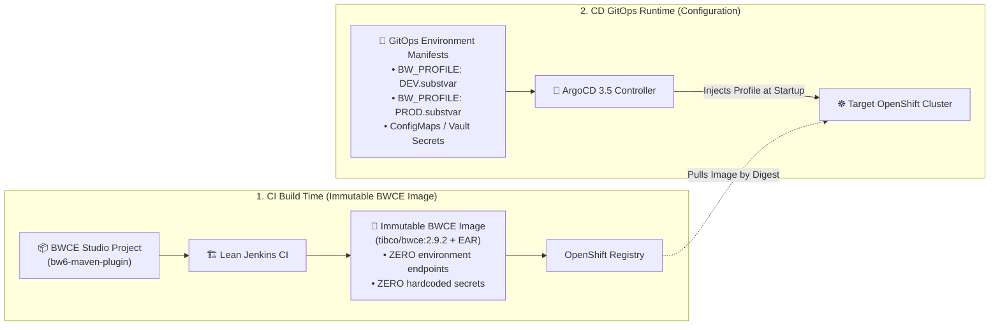

</details>

#### 2. Why This Repository Uses a Unified Platform Monorepo

Rather than fragmenting into 3 separate Git repositories (`bwce-app-repo`, `ci-platform-repo`, and `global-vars-repo`), this project organizes them in a cohesive, self-contained **Platform Blueprint**:

1. **1-Click Reproducibility & Portability**:
   Platform engineers can clone a single repository and execute `./deploy.sh` or `make deploy` to provision Jenkins JCasC, ArgoCD 3.5, ApplicationSets, Datadog APM, and sample BWCE microservices with zero broken links.
2. **Elimination of Jenkins Cross-Repo Parameter Coordination**:
   In the legacy push model, separate repositories were needed because Jenkins had a manual UI form requiring developers to pick combinations of `(BWCE_App_Tag, Substvar_Tag)`. In Pure GitOps, Jenkins does not coordinate parameters—it is event-driven via webhooks.
3. **Atomic Versioning & Traceability**:
   Every commit represents a verified snapshot where Jenkins BWCE builder pod templates (`jcasc/`), pipeline steps (`jenkinsfiles/`), ArgoCD ApplicationSets (`argocd-apps/`), and workload overlays (`sample-apps/`) are guaranteed to be mutually compatible.
4. **Prevention of Orphaned Remote Dependencies**:
   Avoids dependency on external standalone repos that might experience breaking changes, access revocations, or deletion.

#### 3. Platform Monorepo Blueprint vs. Enterprise Polyrepo GitOps Matrix

| Architectural Dimension | Platform Monorepo (This Blueprint) | Enterprise Polyrepo GitOps |
| :--- | :--- | :--- |
| **Repository Topology** | **1 Cohesive Repository** containing IaC, CI, GitOps manifests, and BWCE sample apps. | **2 to 3 Repositories** (`bwce-app`, `ci-platform`, `central-gitops-manifests`). |
| **Target Audience** | Reference architectures, blueprints, platform teams, PoCs, and fast onboarding. | Large enterprises with strict organization boundaries (Integration Teams vs. Platform Ops). |
| **Docker Image Decoupling** | **Fully Decoupled**: Image is built environment-agnostic; overlays inject `BW_PROFILE`. | **Fully Decoupled**: Image is built environment-agnostic; overlays inject `BW_PROFILE`. |
| **Jenkins CI Role** | **Parameterless Multibranch CI**: Builds EAR, scans, signs, and commits tag to local GitOps folder. | **Parameterless Multibranch CI**: Builds EAR, scans, signs, and opens a PR to central GitOps repo. |
| **Jenkins UI Parameters** | **Zero Parameters** (Pure webhook / event-driven). | **Zero Parameters** (Pure webhook / event-driven). |
| **ArgoCD GitOps Role** | Reconciles manifests directly from `sample-apps/gitops-manifests/` or overlays. | Reconciles manifests directly from the central `gitops-manifests` repository. |
| **Rollback & Auditability** | Instant `git revert` or ArgoCD 1-click revision rollback. | Instant `git revert` in the GitOps repo or ArgoCD 1-click revision rollback. |

---

### 6. Enterprise Developer Portals & Governance: Backstage IDP & ServiceNow / Jira ITSM Integration

A critical enterprise architectural consideration is: **How do Internal Developer Portals (Backstage IDP) and ITSM Change Management platforms (ServiceNow, Jira Service Management) integrate with this Pure GitOps pattern?**

#### 1. The Paradigm Shift: From Jenkins API Trigger to GitOps Declarative Governance

In the legacy push architecture ([`jenkins-git-parameter`](https://github.com/nubenetes/jenkins-git-parameter) Pattern 2), Backstage and ITSM platforms called **Jenkins Pipeline 02 via REST API** (`POST /job/02-CD-Release-Orchestrators/job/multi-cluster-release-orchestrator/buildWithParameters`), making Jenkins the central orchestrator and security vulnerability.

In **Pure GitOps (`jenkins-without-git-parameter`)**, Backstage and ServiceNow interact directly with **Git (the Single Source of Truth)** and **ArgoCD 3.5**, while **ArgoCD Notifications** automatically updates tickets and developer catalogs:

<details>
<summary>🔄 <b>Click to expand: Side-by-Side ITSM & Backstage Architectural Flow (Push vs. Pure GitOps)</b></summary>

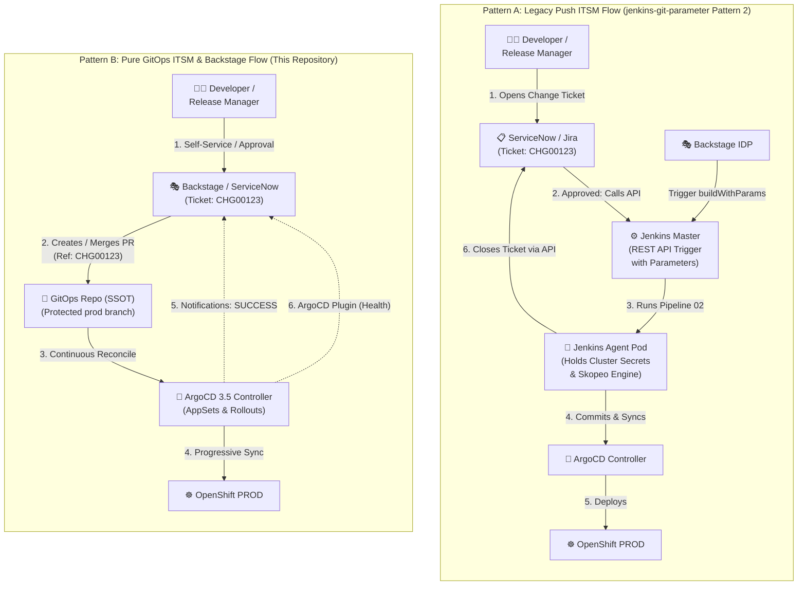

</details>

---

#### 2. Enterprise Sequence Workflow: ServiceNow / Jira ITSM & ArgoCD

<details>
<summary>⚡ <b>Click to expand: ServiceNow / Jira ITSM Automated Change Approval & Reconciliation Sequence Diagram</b></summary>

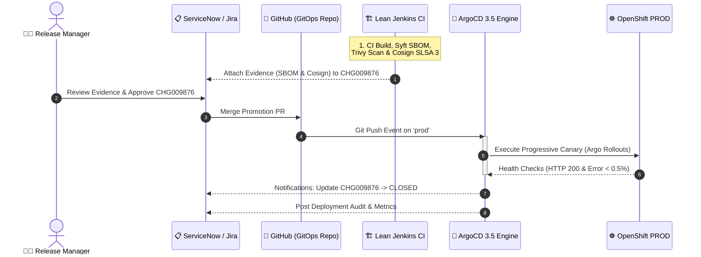

</details>

---

#### 3. Backstage IDP & ServiceNow Integration Details

* **🎭 Backstage IDP (Developer Self-Service & Catalog)**:
  - **Promotion Scaffolder Template**: Backstage uses `@backstage/plugin-scaffolder-backend` action `publish:github:pull-request` to create or merge Promotion PRs in the GitOps repository.
  - **Live Cluster Observability**: Developers view real-time sync status, health checks, pod logs, and canary rollout graphs directly within the Backstage Entity Page via `@roadiehq/backstage-plugin-argo-cd` or Red Hat Developer Hub (RHDH).
* **📋 ServiceNow / Jira ITSM (Change Management & SOX Compliance)**:
  - **Automated Evidence Collection**: Jenkins CI attaches the **Cosign SLSA 3 signature link**, **CycloneDX SBOM**, and **Trivy vulnerability scan report** directly to the pending ServiceNow Change Request (`CHG009876`).
  - **Automated Ticket Closure**: The **ArgoCD Notifications Controller** detects healthy cluster deployment and sends a webhook to ServiceNow (`PATCH /api/now/table/change_request/<id>`) transitioning the ticket to `Closed / Implemented`.

---

#### 4. Comparison Matrix: ITSM & Backstage Integration (Push vs. Pure GitOps)

| Integration Dimension | Legacy Pattern 2 (`jenkins-git-parameter`) | Pure GitOps (`jenkins-without-git-parameter`) | Advantage & Recommendation |
| :--- | :--- | :--- | :--- |
| **Trigger Mechanism** | **Imperative API**: Backstage/ITSM calls Jenkins `buildWithParameters`. | **Declarative Git**: Backstage/ITSM creates or merges a GitOps PR. | 🏆 **GitOps**: Standard Git audit trail (cryptographically signed). |
| **Credential Storage** | Backstage/ServiceNow stores Jenkins admin credentials; Jenkins holds cluster tokens. | **Zero-Trust**: ServiceNow only holds a scoped GitHub PR merge token. No cluster tokens. | 🏆 **GitOps**: Minimal attack surface. |
| **Developer Experience in Backstage** | Blind: Backstage only shows Jenkins job console logs. | **Rich & Live**: Backstage ArgoCD Plugin renders live Pod topology, sync status, and rollout progress. | 🏆 **GitOps**: Superior inner-to-outer loop developer UX. |
| **Audit & Compliance (SOX / SOC2)** | Fragmented across Jenkins build history and ServiceNow. | **Unified in Git**: Every production change has an immutable Git commit, peer reviews, and ServiceNow Change ID. | 🏆 **GitOps**: 100% auditable Single Source of Truth. |
| **Failure & Rollback Flow** | Developer must log into Jenkins or ServiceNow and manually re-run an older build. | Instant: `git revert <commit>` in Git, or click 1-click Rollback in ArgoCD/Backstage UI. | 🏆 **GitOps**: Sub-second deterministic rollback. |
| **Post-Deploy Ticket Closure** | Jenkins Pipeline script executes custom Groovy REST calls at the end of the job. | **Native ArgoCD Notifications**: Event-driven webhook engine handles ticket state transitions. | 🏆 **GitOps**: Resilient; not tied to a running Jenkins pod. |

---

## TIBCO BWCE Cloud-Native Best Practices

### 1. 12-Factor Profile Externalization via `.substvar`

TIBCO BWCE microservices strictly adhere to 12-Factor App principles. The application `.ear` contains no hardcoded environmental parameters. At runtime, the container reads the appropriate profile based on the environment variable `BW_PROFILE`:

* **DEV**: `BW_PROFILE: DEV.substvar` (Internal mock endpoints, debug logging).
* **STAGING**: `BW_PROFILE: STAGING.substvar` (UAT databases, staging endpoints).
* **PROD**: `BW_PROFILE: PROD.substvar` (Production databases, Vault secrets, warning logging).

### 2. Engine Sizing & JVM Performance Tuning

BWCE runs inside an optimized OpenJ9 or HotSpot JVM. Recommended enterprise container sizing:

```yaml
resources:
  requests:
    cpu: "500m"
    memory: "1024Mi"
  limits:
    cpu: "2000m"
    memory: "2048Mi"
env:
  - name: BW_JAVA_OPTS
    value: "-Xms1024m -Xmx1536m -XX:+UseG1GC -javaagent:/opt/datadog/dd-java-agent.jar"
  - name: BW_ENGINE_THREADCOUNT
    value: "16"
```

---

## Datadog Full-Stack Observability Architecture

### 1. Jenkins CI/CD Visibility Plugin
The official Datadog Jenkins Plugin emits pipeline performance traces, queue times, and step execution metrics directly to Datadog CI Visibility.

### 2. TIBCO BWCE Java APM Tracer & DogStatsD
The Datadog Java Tracer (`dd-java-agent.jar`) is injected into the BWCE container runtime. It captures:
* End-to-end distributed traces across REST, SOAP, and JMS activities.
* Engine process metrics: Active process instances, execution duration, thread pool utilization.
* JVM garbage collection and heap utilization.

### 3. Progressive Delivery with Argo Rollouts & Datadog Metrics SLA
During production deployments, **Argo Rollouts** executes a canary rollout (20% $
ightarrow$ 50% $
ightarrow$ 100%) and queries Datadog metrics via an `AnalysisTemplate`. If the HTTP 5xx error rate exceeds 0.5%, the rollout automatically aborts and rolls back to stable.

---

## Comprehensive Mermaid Architecture Diagrams & Workflows

### 1. Parameter Flow Comparison (Jenkins Proxy vs. Pure GitOps)

<details>
<summary>🔄 <b>Click to expand: Parameter Flow Comparison Diagram (Jenkins Proxy vs. Pure GitOps)</b></summary>

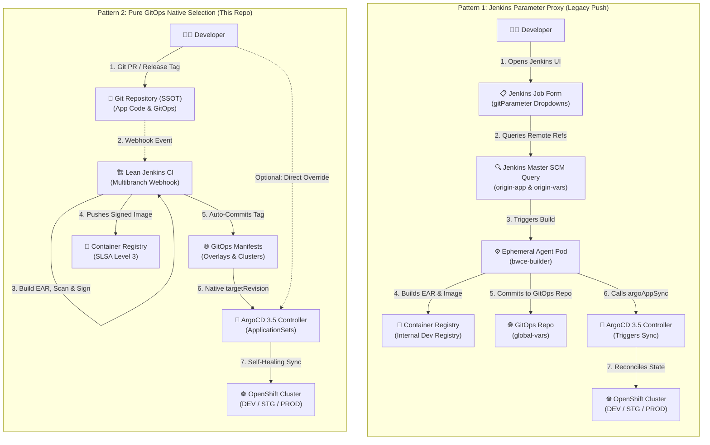

</details>

---

### 2. Legacy Global-Vars vs. Pure GitOps Repository Topology

<details>
<summary>🌐 <b>Click to expand: Legacy Global-Vars vs. Pure GitOps Repository Topology Diagram</b></summary>

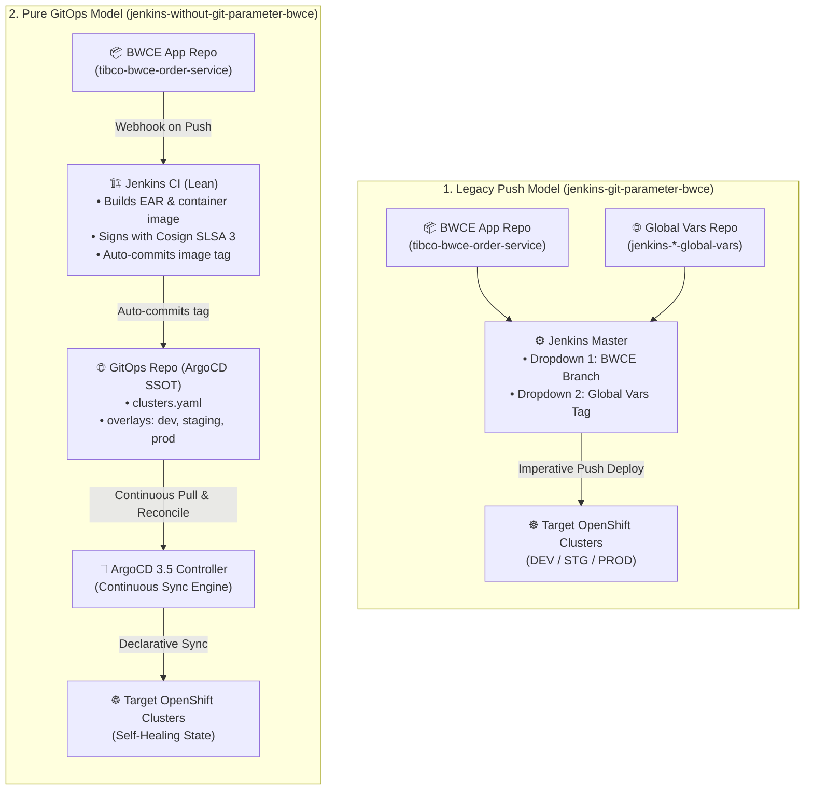

</details>

---

### 3. End-to-End Multi-Cluster Platform Topology

<details>
<summary>🗺️ <b>Click to expand: End-to-End Multi-Cluster Platform Topology Diagram</b></summary>

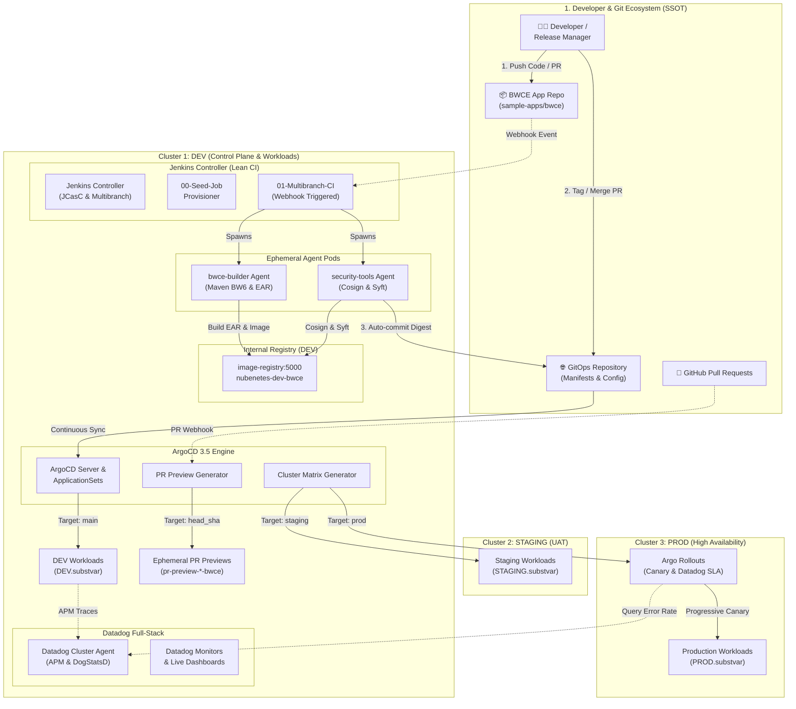

</details>

---

### 4. Jenkins SCM Pre-Execution Lifecycle Blindspot

<details>
<summary>⚠️ <b>Click to expand: Jenkins SCM Pre-Execution Lifecycle Blindspot Diagram</b></summary>

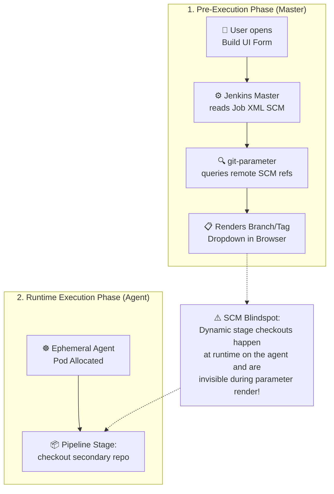

</details>

---

### 5. Side-by-Side Flow Comparison: Push vs. Pull

<details>
<summary>🔄 <b>Click to expand: Side-by-Side Architectural Flow (Push vs. Pull)</b></summary>

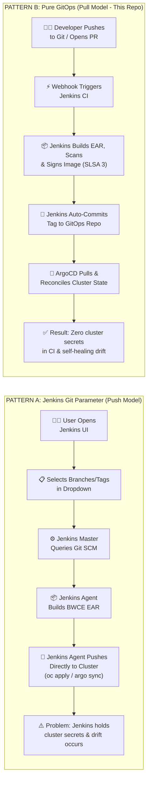

</details>

---

### 6. Dynamic Ephemeral Pull Request (PR) Preview Environments for BWCE

<details>
<summary>⚡ <b>Click to expand: Dynamic Ephemeral PR Preview Environments Sequence Diagram</b></summary>

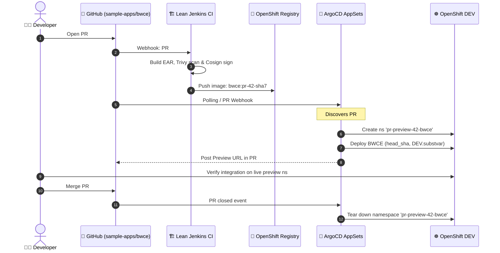

</details>

---

### 7. Automated BWCE CI -> GitOps Promotion Sequence

<details>
<summary>🚀 <b>Click to expand: Automated BWCE CI -> GitOps Promotion Sequence Diagram</b></summary>

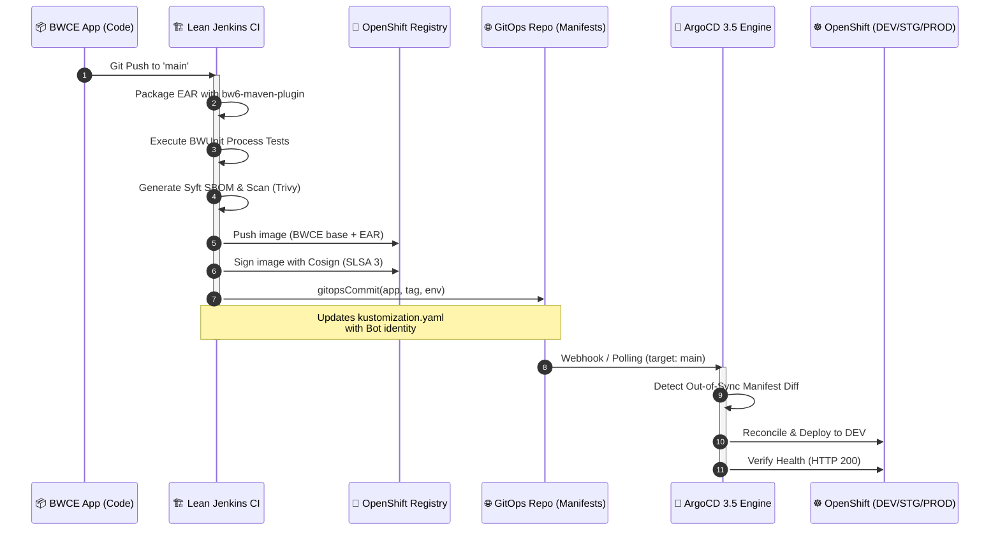

</details>

---

### 8. ArgoCD Multi-Cluster Matrix Reconciliation Engine for BWCE

<details>
<summary>⚙️ <b>Click to expand: ArgoCD Multi-Cluster Matrix Reconciliation Engine Diagram</b></summary>

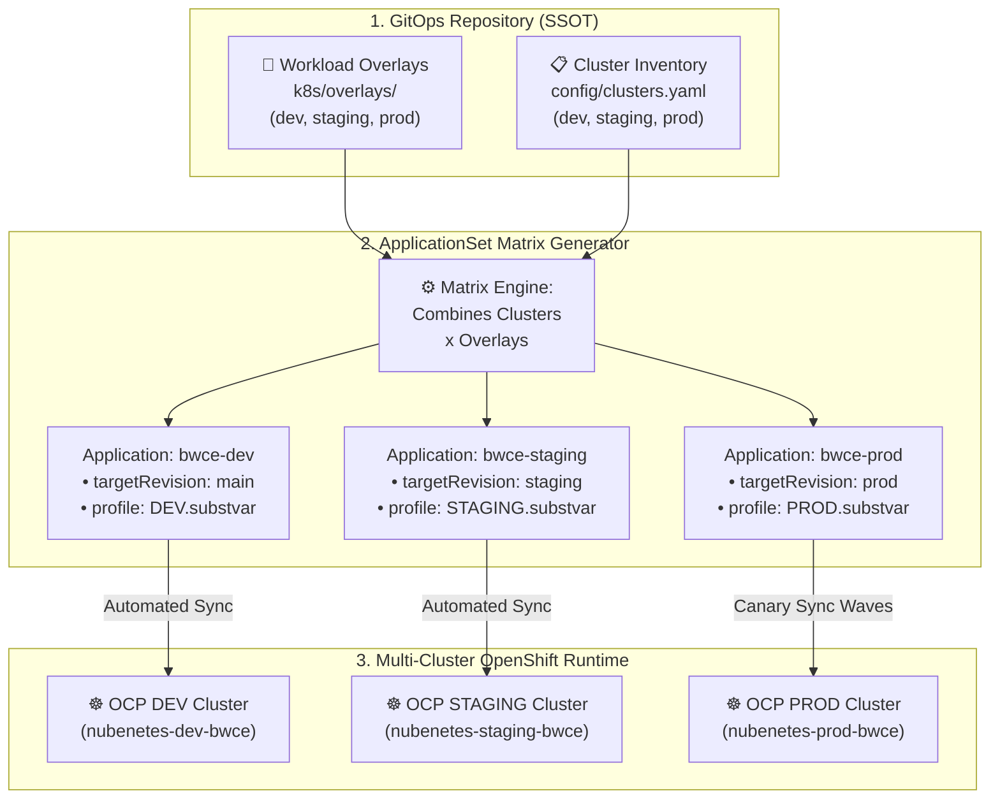

</details>

---

### 9. Zero-Trust Security & RBAC Boundary Architecture

<details>
<summary>🛡️ <b>Click to expand: Zero-Trust Security & RBAC Boundary Architecture Diagram</b></summary>

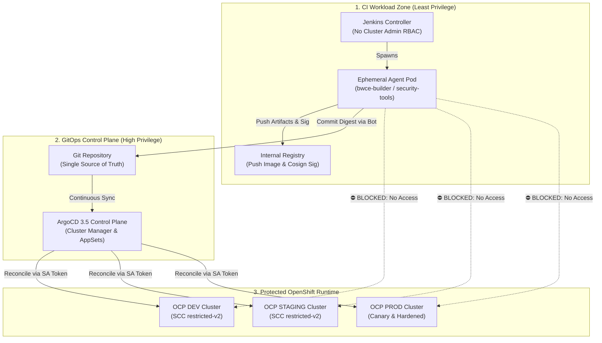

</details>

---

### 10. Progressive Delivery with Argo Rollouts & Datadog SLA

<details>
<summary>📊 <b>Click to expand: Progressive Delivery & Datadog SLA Analysis Diagram</b></summary>

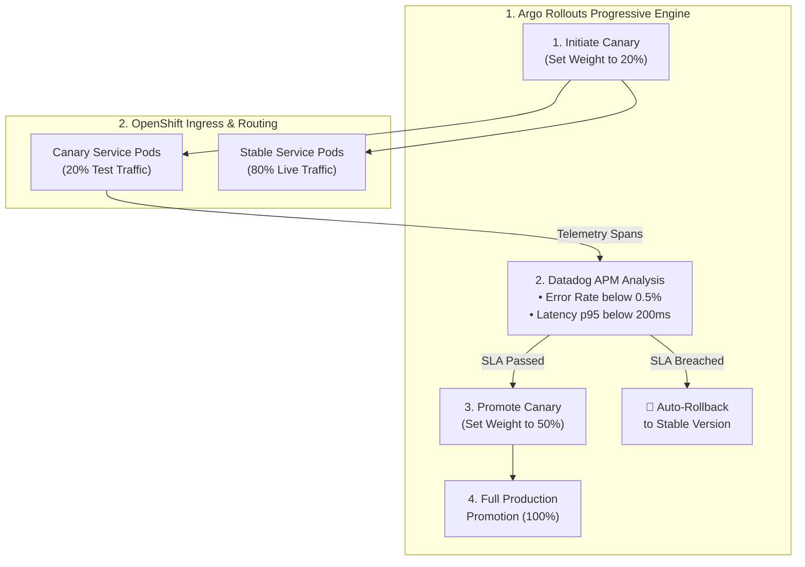

</details>

---

### 11. Full-Stack Observability & Trace Context Propagation with Datadog

<details>
<summary>🔭 <b>Click to expand: Full-Stack Observability & Datadog Trace Propagation Diagram</b></summary>

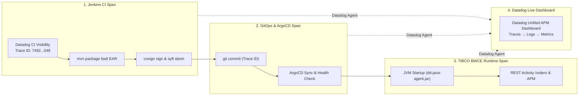

</details>

---

## Which Pattern is Easier, Recommended, and Why?

### 🏆 Final Recommendation: Pure GitOps (`jenkins-without-git-parameter-bwce`)

1. **Easier for TIBCO BWCE Developers**:
   - Developers stay in TIBCO Business Studio and Git. Opening a PR automatically triggers CI tests and spins up an ephemeral preview environment on OpenShift with `DEV.substvar` profile.
   - No need to log into Jenkins, wait for remote branches to fetch into dropdowns, and manually submit build forms.
2. **Easier to Maintain for Platform Teams**:
   - No Jenkins SCM multi-remote refspec hacks (`origin-app`, `origin-vars`), no parameter plugin bugs, no pre-execution lifecycle bottlenecks.
3. **Drastically More Secure (Zero-Trust)**:
   - Jenkins has **no Kubernetes or OpenShift deploy credentials**. If a build container is compromised, the production clusters cannot be altered.
4. **Self-Healing & Drift Remediation**:
   - ArgoCD guarantees that cluster state matches Git 24/7. Manual tampering with cluster resources is automatically reverted.

---

## Repository Structure

```text
.
├── .gitignore
├── LICENSE
├── Makefile                                    # Automation CLI (deploy, destroy, reinstall, promote)
├── README.md                                   # Master architectural blueprint & documentation
├── deploy.sh                                   # 1-Click platform deployment script
├── destroy.sh                                  # Clean teardown script
├── reinstall.sh                                # Full wipe and fresh redeployment
├── config/
│   ├── clusters.yaml                           # Multi-cluster topologies (DEV, STG, PRD) & .substvar profiles
│   └── environments.env                        # Environment variables & platform domain endpoints
├── argocd-apps/
│   ├── root-app-of-apps.yaml                   # ArgoCD Root App-of-Apps bootstrapper
│   ├── applicationset-clusters.yaml            # Multi-cluster matrix generator for BWCE
│   ├── applicationset-pull-request-preview.yaml# Dynamic PR preview environment generator for BWCE
│   ├── applicationset-git-branches.yaml        # Git branch/tag tracking generator
│   └── apps/                                   # TargetRevision manifests (dev, staging, prod)
├── helm/
│   ├── jenkins/
│   │   ├── Chart.yaml
│   │   ├── values.yaml                         # Standard Jenkins Helm values
│   │   ├── values-openshift.yaml               # OpenShift 4.20+ hardened values (restricted-v2)
│   │   └── plugins.txt                         # Lean plugins (NO git-parameter plugin)
│   ├── argocd/
│   │   └── values-argocd-3.5.yaml              # ArgoCD 3.5 Helm values with ApplicationSets
│   └── observability/
│       └── datadog-agent-values.yaml           # Datadog Agent Helm values (APM, DogStatsD, Logs)
├── jcasc/
│   ├── jenkins-jcasc.yaml                      # JCasC Master configuration
│   ├── pod-templates.yaml                      # BWCE builder agent pod templates (restricted-v2)
│   └── github-app-credentials.yaml             # GitHub App credentials for SCM & GitOps PRs
├── jenkinsfiles/
│   └── ci/
│       └── Jenkinsfile.app-bwce                # Pure CI: BW6 EAR build, Trivy, Syft, Cosign, GitOps commit
├── jobdsl/
│   ├── seed-job.groovy                         # Master seed job folder provisioner
│   └── pipelines-ci.groovy                     # Multibranch Pipeline Job DSL (Zero parameters)
├── observability/
│   ├── dashboards/                             # Datadog APM, CI Visibility, and GitOps dashboards
│   └── monitors/                               # Datadog monitors & alert rules
├── sample-apps/
│   ├── tibco-bwce-order-service/               # Reference TIBCO BWCE Cloud-Native Microservice
│   │   ├── Dockerfile                          # EAR overlay on tibco/bwce:2.9.2 base image
│   │   ├── pom.xml                             # bw6-maven-plugin configuration
│   │   ├── META-INF/                           # DEV.substvar, STAGING.substvar, PROD.substvar profiles
│   │   ├── Processes/                          # OrderProcess.bwp, HealthCheckProcess.bwp
│   │   ├── rollout/                            # Argo Rollouts Canary & Datadog AnalysisTemplate
│   │   └── k8s/                                # Base & overlays for dev, staging, prod
│   ├── tibco-bwce-customer-api/                # Secondary BWCE REST microservice
│   └── gitops-manifests/                       # Centralized GitOps configuration repository
├── scripts/
│   ├── deploy.sh, destroy.sh, reinstall.sh
│   ├── gitops-promote.sh                       # CLI helper for GitOps release promotion
│   ├── deploy-datadog-agent.sh                 # Datadog Agent deployment script
│   └── setup-argocd-clusters.sh                # Multi-cluster ArgoCD secret registration
├── security/
│   ├── openshift-image-signature-policy.yaml   # Cosign image signature verification policy
│   └── external-secrets-operator/              # Vault / ESO zero-trust secrets integration
└── shared-library/
    └── vars/
        ├── bwceEarBuild.groovy                 # EAR build step
        ├── cosignSign.groovy                   # Cosign container signing step
        ├── sbomGenerate.groovy                 # Syft SBOM generation step
        └── gitopsCommit.groovy                 # Automated GitOps commit / PR step
```

---

## Quick Start: 1-Click Automated Deployment

### Prerequisites

* Red Hat OpenShift Container Platform (OCP) 4.20+ or Kubernetes 1.31+ cluster.
* `oc` or `kubectl` CLI logged in with `cluster-admin` permissions.
* `helm` v3.14+ installed.

### 1. Deploy the Complete Platform

```bash
git clone https://github.com/nubenetes/jenkins-without-git-parameter-bwce.git
cd jenkins-without-git-parameter-bwce

# Deploy the complete TIBCO BWCE platform (Jenkins CI, ArgoCD 3.5, Datadog APM)
./deploy.sh
# or
make deploy
```

### 2. Verify Platform Endpoints

* **Jenkins CI Controller**: `https://jenkins-jenkins.apps.ocp-dev.nubenetes.internal`
* **ArgoCD 3.5 Server**: `https://argocd-server.apps.ocp-dev.nubenetes.internal`
* **Datadog APM Dashboard**: `https://app.datadoghq.com/dashboard/lists`

---

## Decommissioning & Reinstallation

### Clean Decommission

```bash
./destroy.sh
# or
make destroy
```

### Full Reinstallation

```bash
./reinstall.sh
# or
make reinstall
```

---

## References & Standards

1. **TIBCO BusinessWorks™ Container Edition**:
   * TIBCO BWCE Official Documentation: https://docs.tibco.com/
   * TIBCO BW6 Maven Plugin: https://github.com/TIBCOSoftware/bw6-plugin-maven
2. **GitOps & Cloud-Native Standards**:
   * OpenGitOps Principles & Standards: https://opengitops.net/
   * ArgoCD 3.5 Official Documentation: https://argo-cd.readthedocs.io/en/stable/
   * Argo Rollouts Progressive Delivery: https://argoproj.github.io/argo-rollouts/
3. **Datadog APM & Observability**:
   * Datadog Java APM Tracer: https://docs.datadoghq.com/tracing/setup_overview/setup/java/
   * Datadog CI Visibility: https://docs.datadoghq.com/continuous_integration/
4. **Supply Chain Security & Attestation (SLSA Level 3)**:
   * Sigstore Cosign Container Signing: https://docs.sigstore.dev/cosign/overview/
   * Anchore Syft SBOM Generator: https://github.com/anchore/syft
   * Aqua Security Trivy Scanner: https://trivy.dev/
5. **Red Hat OpenShift 4.20+ Hardening**:
   * OpenShift Container Platform Security Context Constraints: https://docs.redhat.com/en/documentation/openshift_container_platform/4.17/html/authentication_and_authorization/managing-pod-security-policies
