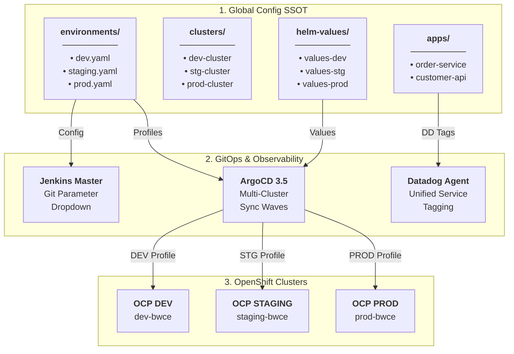

# 🌐 TIBCO BWCE Global Variables & Multi-Cluster GitOps Configuration

[](#)
[](https://docs.tibco.com/)
[](https://www.datadoghq.com/)
[](https://argo-cd.readthedocs.io/)
[](https://www.redhat.com/openshift)
[](https://kubernetes.io/)
[](https://plugins.jenkins.io/git-parameter/)
[](https://external-secrets.io/)
[](https://12factor.net/)
[](LICENSE)

Centralized Single Source of Truth (SSOT) repository storing environment configurations, cluster topologies, application profiles, Helm values, and Datadog observability settings for **TIBCO BusinessWorks™ Container Edition (BWCE)** microservices.

---

> [!IMPORTANT]
> ### ⚠️ Architectural Blueprint & Sovereign Environment Notice
> - **Non-Production Testing Status**: This repository serves as an **architectural reference blueprint, educational design pattern, and foundational boilerplate**. It has **not been tested or executed in a live production environment**.
> - **Sovereign & Air-Gapped Boilerplate**: This project is engineered as a deterministic, version-controlled Infrastructure-as-Code (IaC) template that can be safely used as a **standardized boilerplate in enterprise environments where Agentic AI / LLMs are prohibited** due to data sovereignty, compliance regulations, intellectual property protection, or air-gapped security policies.
> - **Enterprise Hardening**: Platform engineers must review, adapt, and validate all cluster endpoints, TLS certificates, HashiCorp Vault configurations, Datadog API keys, and RBAC quotas prior to production adoption.
> - **AI Generation Attribution**: This architecture, Infrastructure-as-Code implementation, and documentation were generated using **Gemini 3.7 Flash** with **Antigravity**.
> - **Origin & Real-World Heritage**: This blueprint is based on [nubenetes/jenkins-git-parameter](https://github.com/nubenetes/jenkins-git-parameter) and [nubenetes/jenkins-git-parameter-global-vars](https://github.com/nubenetes/jenkins-git-parameter-global-vars), drawing directly from the author's personal hands-on experience designing and operating enterprise integration platforms with these exact requirements (engineered just before agentic AI became widespread).

> [!TIP]
> ### 🚀 Companion Repository (CI/CD & GitOps Orchestration Platform)
> This configuration SSOT is consumed directly by the orchestration platform:  
> 🚀 **[nubenetes/jenkins-git-parameter-bwce](https://github.com/nubenetes/jenkins-git-parameter-bwce)**  
> *(Contains Jenkins JCasC, Job DSL multi-remote pipelines, Datadog Java APM agent injection, ArgoCD 3.5, and Argo Rollouts Canary)*

---

## 🏛️ SSOT Configuration Hierarchy

<details>
<summary>🗺️ <b>Click to expand: SSOT Configuration Hierarchy & Multi-Cluster Mapping Diagram</b></summary>
<br/>



</details>

---

## 🏗️ Repository Structure

```
.
├── environments/                     # Environment definitions & BWCE runtime parameters
│   ├── dev.yaml                      # OCP DEV: Debug logs, DEV.substvar profile, 16 threads
│   ├── staging.yaml                  # OCP STAGING: Info logs, STAGING.substvar profile, 32 threads
│   └── prod.yaml                     # OCP PROD: Warn logs, PROD.substvar profile, 64 threads
├── clusters/                         # OpenShift cluster topology definitions
│   ├── ocp-dev-cluster.yaml          # Primary dev cluster specification
│   ├── ocp-staging-cluster.yaml      # Staging UAT cluster specification
│   └── ocp-prod-cluster.yaml         # Production cluster specification
├── apps/                             # Application catalog & BWCE configurations
│   ├── applications-inventory.yaml   # Service inventory for Backstage IDP / Jenkins
│   ├── tibco-bwce-order-service.yaml # Order service spec & Datadog tags
│   └── tibco-bwce-customer-api.yaml  # Customer API gateway spec
├── helm-values/                      # OpenShift Helm values per service & environment
│   ├── tibco-bwce-order-service/     # Values with Datadog annotations & BW_PROFILE
│   └── tibco-bwce-customer-api/
├── secrets-templates/                # Zero-trust templates (DB, JMS, Datadog)
└── secrets/                          # External Secrets Operator (ESO) Vault sync
```

---

## 🎯 TIBCO BWCE Best Practices Implemented

1. **Profile Externalization via `.substvar`**:
   Environment-specific configurations (`DEV.substvar`, `STAGING.substvar`, `PROD.substvar`) are cleanly decoupled from the application archive (`.ear`) and injected at runtime using `BW_PROFILE`.
2. **Engine Tuning & 12-Factor Design (No CPU Limits + Namespace Governance)**:
   - **No CPU Limits on Pods**: CPU limits are intentionally omitted at the container level to eliminate Linux CFS Bandwidth Throttling on multi-threaded JVM/BWCE processes.
   - **Namespace ResourceQuotas**: Aggregate cluster CPU/Memory consumption is governed at the OpenShift Project boundary ([`cluster-quotas/namespace-resource-quota.yaml`](cluster-quotas/namespace-resource-quota.yaml)).
   - `BW_ENGINE_THREADCOUNT`: Dynamically scaled per environment (16 in DEV, 32 in STAGING, 64 in PROD).
   - `BW_STEP_FLOWLIMIT`: Throttles memory footprint during high-throughput burst traffic.
   - `BW_CONTAINER_SHUTDOWN_TIMEOUT_SECONDS`: Ensures graceful in-flight process completion upon SIGTERM.
3. **Datadog Unified Service Tagging**:
   Standardized `env`, `service`, and `version` tags injected across K8s labels, container env vars, and JVM parameters (`-javaagent:/opt/datadog/dd-java-agent.jar`).
4. **OpenShift `restricted-v2` Compliance**:
   All workloads run as non-root user `uid: 1001` with read-only root filesystems and explicit ephemeral storage.

---

## 🔗 Related Repositories
- **Orchestration Platform**: [jenkins-git-parameter-bwce](https://github.com/nubenetes/jenkins-git-parameter-bwce)
- **Base Generic Global Variables SSOT**: [nubenetes/jenkins-git-parameter-global-vars](https://github.com/nubenetes/jenkins-git-parameter-global-vars)
- **Base Generic CI/CD Blueprint**: [nubenetes/jenkins-git-parameter](https://github.com/nubenetes/jenkins-git-parameter)
